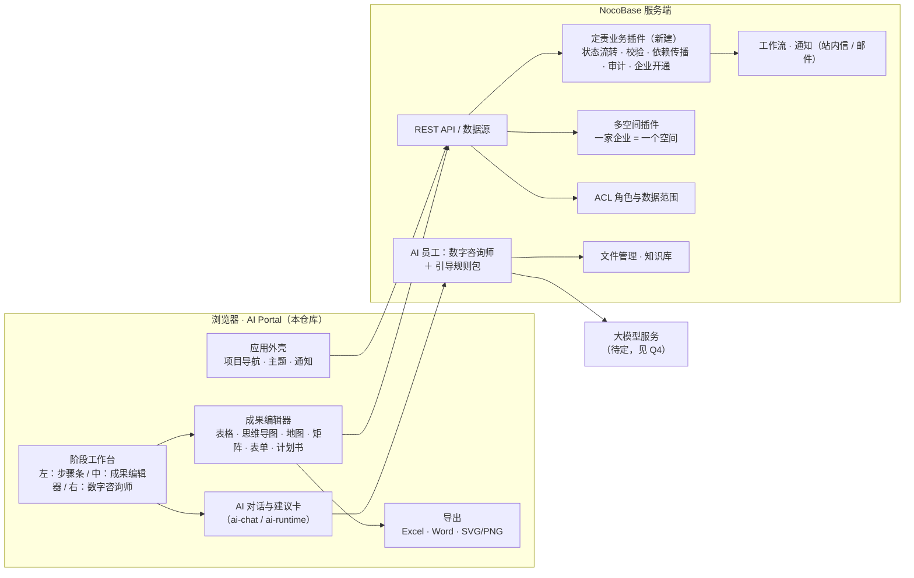
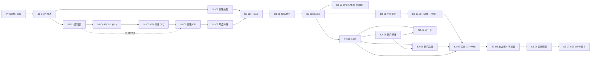
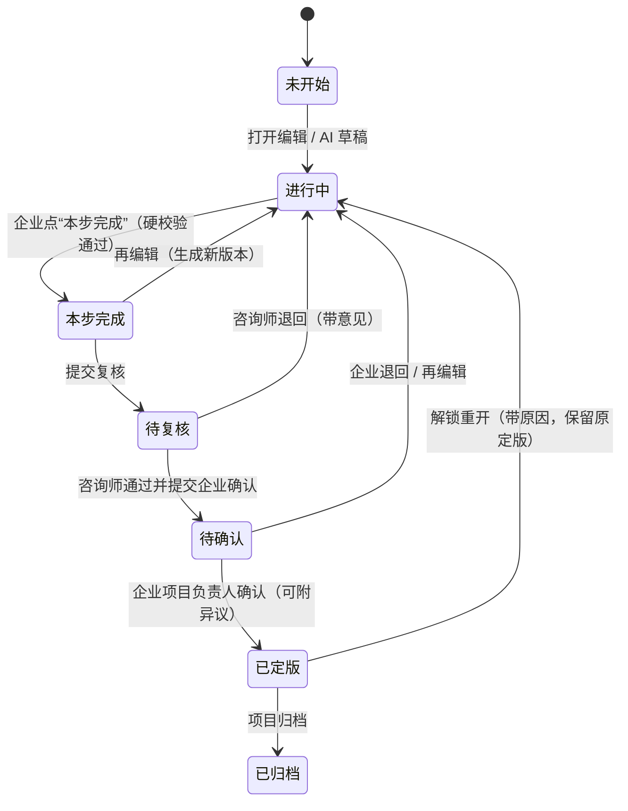

# 企业战略咨询平台 · 概要设计（V0.4）

> 依据：《企业战略咨询平台需求规格说明书 V1.2》（2026-09-29）、设计稿 OPS-72 v1.3（02 核心工作台、10 思维导图 / 表格修改与批注）、“青金山水”设计 token、三张定责管理检查表、`ziqu-dingze` 方法论 skill 包。
> 范围：V1 = 定三责（定战略责、定目标责、定行动责）＋运营管理。本稿**不考虑线上环境已有的数据和表结构**，按规格从头设计；落地时再与线上做差异比对。
> 状态：架构级决策已定（第 0 章），第 9 章剩余口径问题按建议默认先行。

---

## 0. 已定决策（2026-10-09）

| # | 决策 | 对设计的影响 |
|---|---|---|
| D1 | **可以部署自定义 NocoBase 服务端插件** | 新建定责业务插件，承载状态流转、硬校验、定版不可改、下游失效传播、审计和企业开通等业务动作（第 2 章）。 |
| D2 | **成果存储按建议**：整张成果存结构化快照做版本；定版后投影到查询表 | 第 5.4、5.5 节。 |
| D3 | **多企业放在一个 NocoBase 实例里，用多空间插件隔离** | 一家企业 = 一个空间。企业侧数据表都带空间字段；平台级的方法论、规则包、咨询团队等不带空间字段，全平台共享（第 3.3 节）。 |
| D4 | **用云服务大模型，企业资料可以发给模型** | AI 可以直接使用企业资料、画像和成果内容做上下文（第 6 章）。 |
| D5 | **训练营前必须可用的范围：完整的三定流程＋运营管理** | 定战略责、定目标责、定行动责三个阶段的全部 P0 成果，加上运营管理（企业开通、成员、咨询团队、项目分派、方法与规则包维护、咨询师工作台）。里程碑见第 10 章。 |
| D7 | **10 月底开营，所有能力开营前完成；`ziqu.aihupo.cn` 即测试环境** | 不再区分“训练营后”范围；开发、E2E 和演练数据都写在该环境。里程碑按 3 周排（第 10 章）。 |
| D8 | **AI 员工按 NocoBase 官方“内置 AI 员工”方式开发** | 数字咨询师、Skill（引导规则包）、Tool 都以文件形式写在定责业务插件里，随插件版本发布与回滚（第 6 章）。 |
| D6 | **战略屋 V1 做** | S1-01 支持六分法和战略屋两种表达，战略屋带屋形图视图，并承载价值观共识（第 5.6 节）。 |

---

## 1. 设计目标与约束

### 1.1 目标

1. 把三张管理检查表的“工作任务 → 实施步骤”变成**按书的顺序逐表推进的步骤条**，每一步落到一张结构化成果表（S1-01 … S3-08）。
2. 成果以**结构化数据**为唯一事实来源；表格、思维导图、战略地图、矩阵、Excel、Word 都是同一份数据的不同视图。
3. 每个成果走“AI 草稿 → 企业共创 → 本步完成 → 咨询师复核 → 企业确认 → Locked”的生命周期，上游变更时下游自动标“上游已变更”。
4. 数字咨询师的价值在“引导的逻辑”：追问而不是直接生成；建议必须经用户“确认写入”才进入成果。
5. 企业之间严格隔离，关键操作全程留痕。

### 1.2 约束

| 类别 | 约束 |
|---|---|
| 技术底座 | NocoBase 2.x 服务端（数据、ACL、认证、工作流、通知、文件、AI 员工）＋本仓库的 AI Portal 前端（React、TypeScript、Refine、React Router、Tailwind、shadcn Base UI）。不得引入 Ant Design。 |
| 终端 | V1 只面向 PC 浏览器（规格 Q13 默认）；仍需保证 1024 宽度可用。 |
| 语言 | 简体中文。 |
| 依赖 | 前端新增包一律进 `devDependencies`（AGENTS.md）。 |
| 方法论 | 表头、列、层级以书稿表号为验收基线（R11 / Q7）；偏离须登记。 |
| 范围外 | 后四步（赋权、兑利）；环境盘点二十问、战略务虚会、质询会、经营目标责任书（S3-09）与签订会；多层组织；手机 / 微信登录；计费。 |
| 服务端前提 | NocoBase 企业版能力：多空间插件（已启用）、AI 员工、AI 知识库、工作流、通知、审计日志。 |

---

## 2. 总体架构



**分层原则**

- **前端只负责编辑和展示**。凡是关系到“谁能做、能不能做、做完影响谁”的规则（状态流转、RACI 硬校验、六分法凑齐、锁定不可改、下游标记失效、审计），都放到服务端执行，前端同时做即时提示。原因：NocoBase 的 ACL 只能控制“能否操作某张表 / 某类记录”，表达不了“只有本项目的企业项目负责人能确认、已锁定版本不可改”这类按记录状态和项目角色判断的规则。
- **AI 只产出建议**。数字咨询师通过前端 Tool 产生“修改建议”，用户在建议卡上确认后，由前端调用普通的保存接口写入草稿；AI 不直接写库。

---

## 3. 角色与权限模型

### 3.1 两层角色

| 层 | 角色 | 说明 |
|---|---|---|
| 系统角色（NocoBase role，决定能进哪些菜单） | 咨询管理员、咨询师、企业管理员、企业成员、运营管理员 | 用户登录后拥有的全局身份。 |
| 项目角色（项目成员表里的字段，决定在某个项目里能做什么） | 企业项目负责人、部门负责人、项目成员、只读成员；主咨询师、协作咨询师 | 同一用户在不同项目里可以是不同角色。企业确认权只属于“企业项目负责人”（Q1、Q2）。 |

### 3.2 关键操作矩阵（V1）

| 操作 | 企业项目负责人 | 部门负责人 / 项目成员 | 只读成员 | 主咨询师 | 协作咨询师 | 咨询管理员 |
|---|---|---|---|---|---|---|
| 编辑草稿、与数字咨询师对话 | ✔ | ✔ | — | ✔（修订） | ✔ | ✔ |
| 本步完成（解锁下一张表） | ✔ | ✔（待确认，见 Q6） | — | — | — | — |
| 提交复核 / 退回 / 通过复核 | — | — | — | ✔ | 批注 | ✔ |
| 企业确认 → Locked | ✔ | — | — | — | — | 带原因强制定版 |
| 记录异议（反对但承诺执行） | ✔ | ✔ | — | — | — | — |
| 解锁重开 | 申请 | — | — | ✔（带原因） | — | ✔（带原因） |
| 跳步例外 | — | — | — | ✔（带原因） | — | ✔ |
| 导出 | ✔ | ✔ | ✔（草稿带水印） | ✔ | ✔ | ✔ |

### 3.3 数据隔离（多空间，D3）

**机制**（据多空间插件的前端实现确认）：

- 数据表带 `space` 字段（多对一关联 `spaces`，外键 `spaceName`）才参与空间逻辑：新建记录自动归入当前空间，查询只返回当前空间的记录。
- 前端在每个请求上带两个请求头：`x-spaces`（当前空间，用于写入和默认查询）、`x-spaces-view`（同时查看的空间，可多选）。
- `spaces:my` 返回当前用户可进入的空间、默认空间和可查看空间；`spaces:setDefaultSpace` 设置默认空间。

**本平台的用法**：

| 项 | 设计 |
|---|---|
| 空间粒度 | 一家企业 = 一个空间。企业的多个年度或专题项目都在同一空间里。 |
| 带空间字段的表 | 企业档案、组织部门、企业成员、项目、项目成员、成果、成果版本、方法底稿、修改建议、批注、异议、审计事件、跳步例外、企业画像、资料、导出记录、专家咨询申请、AI 对话关联、用量。 |
| 不带空间字段的表（全平台共享） | 成果目录与方法版本、引导规则包及版本、引导缺口记录、咨询团队、平台案例库（经审核脱敏）。 |
| 企业用户 | 只加入本企业空间；Portal 登录后自动使用该空间，不显示空间切换。 |
| 咨询师 | 加入其负责的各企业空间。咨询师工作台用 `x-spaces-view` 同时查看多个空间，进入某个项目时把 `x-spaces` 切到该项目所在空间。 |
| 运营管理员 | 开通企业时由业务插件一次完成：建空间 → 建企业档案 → 建企业管理员账号并加入空间 → 发邀请。 |
| 空间内再细分 | 同一企业有多个项目时，项目成员表决定谁能进哪个项目；业务插件对写操作二次校验项目角色。 |

**前端接入**：Portal 不加载 NocoBase 主界面的插件前端，所以要在应用自己的 API 客户端上加请求拦截器，按“当前项目所在空间”设置这两个请求头，并处理空间变更后的数据刷新。

**待在测试环境验证**（M0 第一件事）：服务端是否拒绝访问用户未加入的空间；业务插件的自定义动作和工作流里如何读取当前空间；AI 员工调用数据工具时是否继承请求的空间；AI 知识库是否支持按空间隔离（不支持时按企业建独立知识库并在检索时过滤）。

企业私有知识默认不被其他企业检索；跨企业隔离按规格 5.6 第 4 条做验证用例（项目、成果、知识检索、文件下载、通知）。

---

## 4. 信息架构与页面

### 4.1 导航

参照设计稿 02：进入项目后用**顶部项目导航**，侧边栏只留项目切换和全局入口。

```
登录
├─ 我的项目（企业侧首页）／ 咨询师工作台（咨询侧首页）
├─ 项目 /projects/:projectId
│   ├─ 工作台        项目概览：阶段进度、待办、上游已变更、待补资料
│   ├─ 咨询工作区    阶段工作台（三栏）← 主战场
│   ├─ 成果与定版    成果管理页（23 项，状态 / 版本 / 差异 / 筛选 / 导出）
│   ├─ 交付          正式交付物、各部门绩效计分卡、导出记录
│   └─ 资料与画像    企业画像（事实 / 假设 / 未知 / 待补）、资料库
├─ 专家咨询
└─ 运营管理（训练营前必备，D5）
    ├─ 企业与开通      开通企业（建空间、企业管理员、邀请码）、停用
    ├─ 成员与组织      企业成员、组织部门（企业管理员维护本企业，运营管理员可代维护）
    ├─ 咨询团队        咨询师、咨询管理员
    ├─ 项目与分派      新建项目、绑定方法与规则包版本、分派主咨询师 / 协作咨询师、项目成员与项目角色
    ├─ 方法与规则包    成果目录、当前生效的数字咨询师与 Skill 版本（只读）、引导缺口记录与评审
    └─ 运营看板        各企业 / 项目阶段进度、待复核 / 待确认积压、AI 用量（只记录不计费）
```

咨询师工作台（规格二(十二)）是咨询侧首页：按企业、项目、阶段、成果状态列出待补资料、待复核、待企业确认、上游已变更、待跟进事项，跨空间汇总。

### 4.2 阶段工作台（核心页面）

```
┌ 顶栏：项目名 · 阶段切换（定战略责 / 定目标责 / 定行动责）· 协作者在线 · 通知 · 白天/黑夜/自动 ┐
├──────────────┬───────────────────────────────────────┬───────────────────┤
│ 左：步骤条    │ 中：成果区                              │ 右：数字咨询师      │
│ 工作任务       │ 面包屑 · 成果名 · 编号 · 状态 · 保存状态   │ 当前步骤引导卡        │
│  └ 实施步骤    │ 上游输入（引用的版本）                   │ 对话（追问 / 建议卡）  │
│    └ 子步骤    │ 视图切换：思维导图 / 表格 / 地图版式      │ 批注 · 修订 · 书中方法 │
│ 每步状态徽标   │ 编辑器 · 校验条 · 合计 / 推得回来提示     │ 输入框（可引用格子）   │
│ 下一步提示     │ 本步完成 / 提交复核 / 确认 / 导出         │                   │
└──────────────┴───────────────────────────────────────┴───────────────────┘
```

URL 设计（每个面板都能直达、刷新、分享）：

| 画面 | URL |
|---|---|
| 阶段工作台某张成果 | `/projects/:projectId/stages/:stage/:artifactCode` |
| 子步骤（如解码地图子步骤 2） | `…/:artifactCode?sub=2` |
| 修订对比（抽屉） | `…/:artifactCode/revisions/:rev` |
| 复核 / 确认 / 重开（对话框） | `…/:artifactCode/review`、`/confirm`、`/reopen` |
| 批注线程（抽屉） | `…/:artifactCode/comments/:threadId` |
| 成果管理 / 交付 | `/projects/:projectId/artifacts`、`/projects/:projectId/delivery` |

### 4.3 三张检查表 → 步骤条映射（红框两列）

**定战略责**（阶段一，清晰共识）

| 工作任务 | 实施步骤 | 成果 / 处理 |
|---|---|---|
| 内容共识：纷繁战略简约化 | 战略简约六分法（目的、方向、战略目标、策略选择、步骤举措、指标体系） | **S1-01** 六分法表／战略屋（D6，两种表达同一成果，见 5.6 节） |
| 逻辑共识：简约战略逻辑化 | 战略哲学：使命共识 / 愿景共识 / 价值观共识 | 使命五要素、愿景三法为 S1-01 下的方法底稿，结论回写“目的（使命）”“方向（愿景）”；价值观写入战略屋屋顶 |
| | 战略分析与决策：通用逻辑（图 2-5）/ 业务逻辑（图 2-6） | 数字咨询师的提问脚手架，不出成果 |
| | 战略内容：战略地图 | **S1-02** 战略地图（P0，表格为主，图为同源视图） |
| 衡量共识：逻辑战略指标化 | 第一步 导出企业战略和策略 | **S1-03** 战略·策略逻辑表（P0） |
| | 第二步 设定衡量指标（明确主题 → IPOOC 拆解 → 设指标 → SMART） | **S1-04** IPOOC 指标设计表（P1，可跳过） |
| | 第三步 筛选战略 KPI | **S1-05** KPI 筛选评价表（P1，可跳过）→ **S1-06** 战略 KPI 表（P0） |
| | 第四步 设定指标值并分解至 3–5 年 | **S1-07** 战略 KPI 年度分解表（P0） |
| 表外 | 战略共创共识会 | V1 不做流程对象 |

**定目标责**（阶段二，纵横贯通）

| 工作任务 | 实施步骤 | 成果 / 处理 |
|---|---|---|
| 路径支撑，确保结果必赢 | 第一步 定目标：回顾公司战略、编制年度经营预算、确定关键年度目标 | **S2-03 目标区**；经营预算为方法底稿 |
| | 第二步 找路径（战略地图）：股东价值差距 → 客户价值主张 → 关键价值创造流程 → 战略资产准备度 → 导入 Excel 表格式路径系统图 | **S2-01** 年度战略解码地图（子步骤 1–4）→ 子步骤 5 导入 **S2-03 路径区** |
| | 第二步 找路径（路径系统图）：一、二、三（四）级路径 | 在 **S2-03** 表内继续分解；**S2-02** 是它的图形视图 |
| | 第三步 抓关键 ＋ 第四步 立项目 | 抓关键并入立项目（优先级评价表为可选辅助）→ **S2-08** 关键项目列表 |
| 横向到边，责任全域协同 | 列出责任者 → 构建 RACI → 验证与优化 | **S2-04** RACI 矩阵（列出责任者、验证优化为内嵌步骤与校验） |
| | 第四步 动态调整与持续沟通 | V1 范围外 |
| 纵向到底，目标层层击穿 | 找路径 → 分部门 → 挂考核 | **S2-05** 部门目标承接表 → **S2-06** 部门级路径系统 → **S2-07** 绩效计分卡 |
| 表外 | 董事会 / 经营层会议 | V1 范围外 |

**定行动责**（阶段三，可视可控）

| 工作任务 | 实施步骤 | 成果 / 处理 |
|---|---|---|
| 任务明确，全局可视 | 环境盘点、战略务虚会 | V1 范围外（培训讲授） |
| | 项目与项目制管理：收集与去噪 → 项目化判定与打标 → 成果导向重命名 → 合并同类项 → 一页式项目章程 → WBS → 优先级、资源与基线 | **S3-01**（S2-08 定版快照，只读）→ 项目化判定（P/S/R，方法底稿）→ **S3-02** 项目任务书（内嵌 **S3-03** WBS） |
| 节点明确，进程可控 | 划分节点 → 输出《计划实施推进表》 | **S3-05** 计划实施推进表（内嵌 **S3-04** 节点表） |
| 资源明确，支撑可见 | 算清需求 → 核对存量 → 补齐缺口 | **S3-06** 项目资源匹配表（财务、人、信息化、物料四类） |
| 年度经营计划书 | 公司计划 / 部门计划 | **S3-07** / **S3-08**（各 8 章，同源章节引用定版成果） |
| 表外 | 质询会、经营目标责任书、业绩合同签订会 | V1 范围外（线下） |

---

## 5. 成果与流程模型

### 5.1 成果目录（配置化）

所有成果在前后端共享一份**成果目录配置**（代码中维护，随版本发布），每项包含：编号、名称、阶段、优先级（P0 / P1 / 内嵌）、所属检查表步骤、依赖（上游编号与引用的版本类型）、编辑器类型、数据结构版本（schema version）、校验规则、书表号、导出模板。步骤条、解锁、依赖传播、校验和导出都读这份配置，避免逻辑散落在页面里。

### 5.2 依赖与解锁



规则（Q1、Q10）：

1. **阶段内**：按步骤条顺序逐表解锁；上一张表“本步完成”即解锁下一张。S2-08 与 S2-04 在 S2-03 完成后同时解锁；P1 底稿可跳过。
2. **阶段间**：本阶段全部 P0 成果 Locked 后，下一阶段才解锁。
3. **引用版本**：阶段内下游引用上游的“本步完成”版本；跨阶段引用 Locked 版本。
4. **变更传播**：上游产生新的“本步完成”或 Locked 版本时，按依赖图把已引用旧版本的下游标“上游已变更”，下游需重新确认引用。
5. **跳步例外**：咨询师带原因开启，记录在例外表，步骤条上显示标记。

### 5.3 成果状态机



- “上游已变更”是叠加在状态上的标记，不是独立状态。
- 咨询管理员可在任意状态带原因强制退回或强制定版，并留痕。
- 硬校验在“本步完成”和“企业确认”两个时点阻断（如 RACI 的 A=1、R≥1；六分法六项凑齐）；草稿编辑时只提示。
- 计划书（S3-07 / S3-08）提交确认前，被引用的本阶段成果须已各自复核确认；计划书 Locked 时一并 Locked。

### 5.4 版本与留痕

- 每次保存产生成果版本，记录来源类型（AI 草稿 / 企业编辑 / 咨询师修订 / 定版）、操作者、基于哪个版本、数据结构版本。
- 版本数据保存为**整张成果的结构化快照**；成果内部每个条目（目标、路径、指标、项目、节点）带稳定 ID，用于跨成果追溯血缘、批注定位和修订对比。
- 定版、解锁、覆盖、权限变更写入审计事件（操作者、时间、原因、前后版本）。
- 规格 5.4 的 AI 质量指标（顾问修改量等）由“AI 草稿版本 vs 定版版本”的差异计算。

### 5.5 数据模型（逻辑）

除第 3.3 节列为“全平台共享”的表外，下列实体都带空间字段。

| 实体 | 关键字段 | 说明 |
|---|---|---|
| 企业 | 名称、状态、对应空间 | 与空间一对一，由业务插件开通 |
| 组织部门 | 企业、上级、名称、负责人 | V1 公司 → 部门两级（RACI 列可到岗位） |
| 企业成员 / 咨询团队成员 | 用户、企业或团队、系统角色 | 邀请码或管理员开通 |
| 咨询项目 | 企业、年度、场景（训练营 / 内训）、方法版本、规则包版本、当前阶段、项目设置（立项层级、推进表刻度） | |
| 项目成员 | 项目、用户、项目角色、所属部门 | 项目角色见 3.1 |
| 成果 | 项目、编号、状态、上游已变更标记、当前 / 本步完成 / 定版版本指针 | 每个项目每个编号一条 |
| 成果版本 | 成果、版本号、来源类型、结构化内容、引用的上游版本、操作者 | 不可修改 |
| 方法底稿 | 同成果版本结构，编号用 M-xx | 使命五要素、愿景三法、经营预算、项目化判定等 |
| 修改建议 | 项目、目标成果、修改内容、来源对话消息、状态（待确认 / 已写入 / 不采纳） | 支撑“确认写入”与 R2 跨表复用 |
| 批注 | 成果、锚点（条目 ID / 格子 / 圈选）、线程、@成员、状态 | |
| 异议 | 成果版本、成员、内容 | 反对但承诺执行 |
| 审计事件 | 对象、动作、操作者、原因、前后版本 | |
| 跳步例外 | 项目、步骤、原因、批准人 | |
| 企业画像条目 | 项目、类别（已确认事实 / 待验证假设 / 未知 / 待补）、内容、来源资料 | |
| 资料 | 项目、文件、类型、说明 | 用文件管理 |
| 引导规则包 / 规则包版本 | 适用步骤、规则内容、版本、发布状态 | 方法论库，可回滚 |
| 引导缺口记录 | 项目、步骤、描述、评审状态 | 顾问记录 → 评审 → 进入新规则包 |
| 导出记录 | 成果版本、格式、是否草稿水印、文件、操作者 | |
| 专家咨询申请 | 项目、议题、引用的定版成果、状态、纪要 | |
| 用量（预留） | 项目、AI 调用次数、tokens | 只记录不计费 |

> 6.3 预留接口（实际完成数据）只在数据模型层预留字段，不做功能。

---

### 5.6 S1-01 的两种表达：六分法与战略屋（D6）

书中两个工具“任选其一”（大型企业偏六分法，中小企业偏战略屋），规格 Q14 默认六分法必做。V1 两种都做，设计为**同一个成果 S1-01 的两种表达**，共用一份战略内容数据：

| 战略内容 | 六分法（表 2-1） | 战略屋（图 2-3） |
|---|---|---|
| 使命 | 目的 | 屋顶 · 使命 |
| 愿景 | 方向 | 屋顶 · 愿景 |
| 价值观 | — | 屋顶 · 价值观 |
| 目标 | 战略目标（5 年＋3 年中期） | 屋身 · 经营目标（1 / 3 / 5 年） |
| 业务组合与打法 | 策略选择 | 屋身 · 主要战场（第一 / 二 / 三增长曲线）＋如何致胜（按战场写可持续核心优势） |
| 时间上的落地 | 步骤举措（两步走 / 三步走） | 屋身 · 必赢之战（年度抓手） |
| 衡量 | 指标体系 | —（经营目标里含财务与非财务目标） |
| 保障 | — | 地基 · 落地保障（组织 / 机制 / 人才） |

- **主表达**：项目设置里选（默认按企业规模：大型企业六分法、中小企业战略屋），咨询师可调整并留痕。工作台默认打开主表达，另一种可切换查看。
- **互相带出**：两种表达对应的格子是同一份数据，改一边另一边同步；只属于一种表达的格子（六分法的指标体系，战略屋的价值观、落地保障）切换过去时由数字咨询师引导补齐。
- **完成门禁**（“本步完成”）：主表达的格子全部填齐（六分法六项；战略屋屋顶三项＋屋身四行＋地基三项，按战场的列至少一列）。另一种表达未填齐不阻断。
- **屋形视图**：战略屋按屋顶 / 屋身 / 地基的屋形渲染（不是扁平列表），可以在图上直接编辑，导出 SVG / PNG 并嵌入 Word。
- **下游衔接**：S1-02、S1-03 读取共用的战略内容数据，不关心主表达是哪一种。

## 6. 数字咨询师（AI）设计

### 6.1 实现方式（D8）

按 NocoBase 官方“创建内置 AI 员工”的方式（`@nocobase/ai` 的 `defineAIEmployee`、`defineTools`，Skill 用 `SKILLS.md`），把数字咨询师写在定责业务插件里：

```
plugin-ziqu/src/ai/ai-employees/
├── ziqu-strategy-coach/          定战略责数字咨询师
│   ├── index.ts                  defineAIEmployee：username 固定为 ziqu-strategy-coach
│   ├── prompt.md                 人设与边界（来自 ziqu-dingze 的 soul）
│   └── skills/
│       ├── ziqu-content-consensus/      六分法 / 战略屋 / 使命五要素 / 愿景三法
│       ├── ziqu-logic-consensus/        战略地图，双二四与业务逻辑提问脚手架
│       └── ziqu-measure-consensus/      逻辑表 / IPOOC / KPI 筛选 / 年度分解
├── ziqu-goal-coach/              定目标责数字咨询师
│   └── skills/
│       ├── ziqu-set-goal/               定目标（往上看、往回看、经营预算）
│       ├── ziqu-find-path/              找路径规则包：增收 7 条、降本、流程 4 类、学习与成长 3 方面
│       ├── ziqu-key-projects/           抓关键 · 立项目
│       ├── ziqu-raci/                   RACI 列责任者、构建、验证优化
│       └── ziqu-cascade/                分部门、部门路径、挂考核
└── ziqu-action-coach/            定行动责数字咨询师
    └── skills/
        ├── ziqu-projectize/             项目化判定、任务书、WBS
        ├── ziqu-milestones/             节点四要素、推进表
        ├── ziqu-resources/              资源四类匹配
        └── ziqu-plan-book/              计划书非同源章节的引导与语言整理
```

- 每个 Skill 的 `SKILLS.md` 写该步的方法说明、追问顺序、注意事项（来自 STEP-NOTES 和规格附录 F）和完成条件；其 `tools/` 目录下的 Tool 自动绑定。
- 三个咨询师共享同一份人设要点（步骤推进、正向鼓励、仪式感、不替用户拍板），各自的 `prompt.md` 指示在哪一步加载哪个 Skill。
- `username` 加 `ziqu-` 前缀，发布后不改；插件重载会覆盖员工定义，所以员工的人设、Skill、Tool 只在代码里改，不在管理界面手工改。

### 6.2 Tool 设计

| Tool | 权限 | 作用 |
|---|---|---|
| `ziqu_read_artifact` | ALLOW | 读当前项目某个成果的当前草稿或指定版本（按空间与项目成员校验） |
| `ziqu_read_upstream` | ALLOW | 读当前成果引用的上游版本摘要 |
| `ziqu_validate_artifact` | ALLOW | 对草稿跑结构校验（六项凑齐、推得回来、A=1、R≥1 等），返回问题清单 |
| `ziqu_propose_changes` | ALLOW | 生成“修改建议”记录（只写建议表，不改成果），前端渲染成建议卡，用户点“确认写入”才写入 |
| `ziqu_propose_to_later_step` | ALLOW | 一次表述、多表复用（R2）：给后续成果生成待确认建议 |
| `ziqu_record_profile_item` | ALLOW | 把对话中的事实写入企业画像，默认归“待验证假设”，用户确认后才成为事实 |

- 所有 Tool 都不直接修改成果、不推进状态；“本步完成”“提交复核”“确认定版”只能由人在界面上操作。所以 Tool 可以设为 ALLOW，不打断对话。
- Tool 在服务端执行，统一经过空间与项目角色校验；按官方要求，模型在收到 Tool 成功结果之前不得声称已写入。

### 6.3 交互原则

- **追问不生成**：用户说不出来时按 Skill 里的规则逐级追问；用户能说出时不打断。不得补造使命、年度目标、指标值。
- **建议卡 → 确认写入**：建议在画面上以琥珀色虚线标出，用户点“确认写入”后才保存为新版本，并标“AI 建议 · 某某确认”。
- **不越权**：不能修改已定版的上游；不能代替“本步完成”“确认”等动作。
- **可随时暂停引导**：用户直接改表或说“把第 2 条改成 320 万方”，AI 出修改卡并重新校验。

### 6.4 前端接入与上下文

- 使用本模板的 `ai-runtime` / `ai-chat`：右栏对话绑定当前阶段的数字咨询师；`AIPageContextScope` 把当前项目、成果编号、子步骤、选中的格子作为页面上下文发送；`ziqu_propose_changes` 的结果用自定义渲染器显示为建议卡。
- 模型：云服务大模型，企业资料、画像、成果内容可以作为上下文发送（D4）。LLM 服务在 NocoBase 中配置，AI 员工绑定该服务；模型名称和密钥不进前端代码。
- 知识库：平台方法论（书稿精华、模板、检查表）建一个全平台共享的知识库；企业资料按企业建库或按空间隔离（见 3.3 待验证项）。
- 用量：每次 AI 回合记录项目、空间、tokens，供运营看板展示（只记录不计费）。

### 6.5 规则迭代

规格要求规则包“随 Agent 发布包发布、可回滚”，与 D8 一致：规则就是 Skill 文件，改规则 = 改插件代码并发版，回滚 = 回退插件版本。运营管理里的“方法与规则包”页只读展示当前生效的 Skill 版本；顾问在对话中或咨询师工作台记录“引导缺口”，评审通过后进入下一版插件。

---

## 7. 成果编辑器与导出

| 编辑器 | 用于 | 要点 |
|---|---|---|
| 战略屋屋形图 | S1-01（战略屋表达） | 屋顶 / 屋身 / 地基结构，按战场分列，可在图上直接编辑，与六分法表格同一份数据 |
| 结构化表格 | S1-01、S1-03～S1-07、S2-03、S2-05、S2-07、S2-08、S3-05、S3-06 | 按书表头的多级表头、合并单元格或分组；就地编辑、键盘导航、合计与“推得回来”实时校验；空骨架＋只读参考样例（标“示例，非本企业内容”） |
| 思维导图 / 树 | S2-01（子步骤 1–4 默认）、S2-02、S2-06、S3-03 | 与表格同一份数据；下级 / 同级、拖动调整、移动到…、撤销；四级路径 |
| 分层地图 | S1-02 战略地图、S2-01 地图版式（导出） | 财务 / 客户 / 内部流程 / 学习与成长四个分区，节点落在分区内且互不重叠，自动布局＋微调 |
| RACI 矩阵 | S2-04 | 行＝关键路径或关键项目（行粒度待定，见 Q9），列＝部门 / 岗位；A=1、R≥1 校验条；风险提示 |
| 表单 | S3-02 项目任务书 | 表 4-4 全字段；P/S/R 判定可复算；五因子优先级 |
| 计划书 | S3-07、S3-08 | 8 章；同源章节自动引用，非同源章节表单录入并确认 |

**技术选型方向（待评审）**：表格基于 TanStack Table 自建（成果表是固定结构，不需要通用电子表格，且避免 Handsontable 等的商业授权问题）；导图与地图用 React Flow（`@xyflow/react`）配合自动布局库；Excel 用 `exceljs`、Word 用 `docx` 在浏览器端生成（S2-03 支持表 3-9、表 3-10 两种布局），草稿带水印，导出写导出记录。

批注、修订对比、撤销按设计稿 10 实现；V1 是否全做见 Q8。

---

## 8. 视觉与体验

关键界面设计稿（8 张：战略屋工作台、找路径、RACI 硬校验、复核与定版、项目工作台、咨询师工作台、运营管理开通企业、状态与组件规范）：https://claude.ai/artifact/1qNcdA1vTq9gAZkTQTLdEq

- 采用“青金山水”token：浅色以深青为品牌主色、深色以暖金为品牌主色；映射到 shadcn 语义变量（background、card、primary、muted、border、sidebar 等），支持白天 / 黑夜 / 自动。
- 成果状态、AI 建议（琥珀虚线）、上游已变更、校验失败使用统一的语义色，不在页面里写一次性颜色。
- 每个 P0 成果至少覆盖：空态、校验失败态、只读态；关键页面满足 WCAG 2.1 AA 关键项（对比度、键盘可达、表单标签、焦点）。

---

## 9. 关键问题澄清

### 9.1 架构级问题（已定）

Q-A 服务端插件、Q-B 成果存储、Q-C 多企业隔离、Q-D 大模型与资料外发，已于 2026-10-09 确定，见第 0 章 D1–D4。

### 9.2 影响功能口径

| # | 问题 | 建议默认 |
|---|---|---|
| Q-E | 同一张表多人同时编辑（训练营 3–10 人）：要实时协同，还是“谁在编辑”提示＋保存冲突检测？ | V1 用后者（乐观锁），显示在线成员和正在编辑的条目；实时协同放后续。 |
| Q-F | “本步完成”谁能点？只有企业项目负责人，还是参与编辑的部门负责人也能点？ | 企业项目负责人和部门负责人都能点（只解锁节奏，不等于确认）；确认只归项目负责人。 |
| Q-G | 一个用户能否在不同项目里担任不同角色（如甲项目是负责人、乙项目是成员）？咨询师是否跨企业？ | 能；角色挂在项目成员上。咨询师可跨企业，但只看被分派的项目。 |
| Q-H | 设计稿 10 的完整编辑能力（批注圈选、@人、按批注修改、修订对比、撤销、快捷键）是否全部进 V1？ | P0：直接改、调结构、撤销、单点批注与回复、版本对比；P1：圈选批注、按批注修改、完整快捷键。 |
| Q-I | RACI 的行粒度：末级路径（书图 3-12）、关键项目（Demo）、还是一级 / 二级路径（随立项层级）？ | 跟随项目“立项层级”设置：用关键项目做行，项目内次级路径的 RACI 到定行动责任务书里再细分。 |
| Q-J | ~~引导规则包由谁维护、放在哪里~~ | 已定（D8）：规则是插件里的 Skill 文件，随插件发版与回滚；方法论方审定内容，引导缺口在运营管理中记录评审。 |
| Q-K | 只读参考样例用书中案例（天然气公司、A 智能装备制造企业）是否有版权或授权问题？A 企业 2030 年收入三种口径统一取哪个？ | 需求方 / 方法论方确认；未确认前样例只用于内部测试。 |
| Q-L | ~~战略屋 V1 是否做~~ | 已定：做（D6）。剩余口径见 Q-Q。 |
| Q-M | Excel / Word 导出：浏览器端生成是否可接受，还是需要服务端生成（便于留档、统一水印）？ | 浏览器端生成＋上传归档到导出记录。 |
| Q-Q | 选了战略屋做主表达的企业，六分法是否还**必须**填齐？（规格 Q14 原口径是六分法必做） | 不必须：主表达填齐即可“本步完成”，六分法按同一份数据自动带出已有内容，缺的格子标“待补”。需方法论方确认。 |

### 9.3 规格中仍待需求方确认的事项（沿用）

- A1 已定：`ziqu.aihupo.cn` 为测试环境，可写测试数据（D7）。A2 已定：可部署自定义服务端插件（D1）。
- Q8(b)(c)：资料发外部模型的告知与合规、网站与算法备案。
- Q12–Q19 次要项按规格默认口径先行。
- 待补资料：找路径规则包的诀窍与话术、绩效计分卡的调整意见、标准案例口径、语料、模拟企业名单、路径层级上限。

### 9.4 时间与范围（已定）

D5、D7：10 月底开营，完整三定流程＋运营管理全部在开营前完成，`ziqu.aihupo.cn` 是测试环境。

## 10. 实施里程碑（按 D7：10 月底开营）

从 10 月 9 日到月底约 3 周，每个里程碑结束都能在测试环境演示。

| 里程碑 | 时间（建议） | 内容 | 验收 |
|---|---|---|---|
| M0 底座 | 10/9 – 10/13 | 验证多空间关键假设（3.3）；定责业务插件骨架（数据表、空间字段、状态流转、硬校验、依赖传播、审计、企业开通）；角色与数据范围；主题；外壳、项目导航、空间请求头；成果目录与步骤条；表格编辑器基础；三个数字咨询师与 Tool 骨架；LLM 服务接通 | 两家测试企业互相不可见；状态机与解锁规则单元测试通过；数字咨询师能读到当前成果并出建议卡 |
| M1 运营管理＋定战略责 | 10/14 – 10/18 | 运营管理全部页面；咨询师工作台；S1-01（六分法＋战略屋屋形图）～S1-07 与方法底稿；复核 / 确认 / 定版 / 重开；Excel 导出 | 规格 5.2 第 7 条“核心闭环实证” |
| M2 定目标责 | 10/19 – 10/23 | 解码地图四层＋导入、路径系统表 / 图到四级、找路径 Skill、S2-08、RACI、部门承接、部门路径、计分卡、表 3-9 / 3-10 导出 | 模拟企业找路径会话跑通 |
| M3 定行动责 | 10/24 – 10/27 | 项目化判定、任务书＋WBS、推进表＋节点、资源匹配、公司 / 部门计划书 Word | 计划书同源章节与上游一致 |
| M4 演练与加固 | 10/28 – 10/30 | 成果管理页与交付页；通知；跨企业隔离验证；关闭自助注册；模拟企业全流程演练（R4）与修复 | 规格 5.2 全部条目 |

**风险**：工期按每个里程碑 4–5 天排，没有余量。为保开营，建议：

- 任一里程碑延期时，优先保证三定主流程和复核定版闭环；成果管理页的“AI 初稿与定版差异”、批注圈选、Word 精排版顺延到演练期间补齐。
- 方法论方需在 10/16 前交付找路径规则的诀窍与话术（规格 E.4 第 1 项）、在 10/20 前交付计分卡调整意见（第 2 项），否则对应 Skill 和 S2-07 先按书稿口径实现。
- 演练用的模拟企业名单和扮演学员（规格 E.4 第 6 项）需在 10/27 前确定。

每个里程碑：前端单元测试（纯逻辑与组件交互）＋针对测试环境的 E2E（登录、空间隔离、权限、数据、AI），并通过生产构建。
